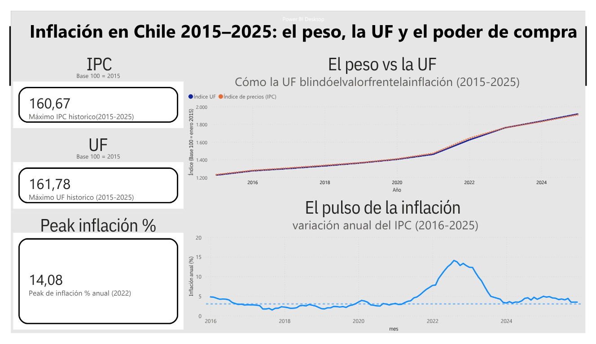

*Read this in other languages: [English](README.md)*


# Pipeline ETL de Inflación — Banco Central de Chile

Pipeline de datos **automatizado de extremo a extremo** que extrae las series UF e IPC desde la API del Banco Central de Chile, luego, las procesa, las almacena en una base de datos, y por último se visualizan en un dashboard interactivo de Power BI. Todo el flujo corre 1 vez al mes los días de actualización de datos del BCCh.

---

## El problema

Cuando el dinero pierde valor a lo largo del tiempo, ¿Cuánto de su valor se evapora realmente? ¿Y sirve de algo protegerse?

Este proyecto responde con datos reales del BCCh.

**¿Cuánto valor perdió la moneda desde el 2015 hasta el 2025, y cuánto se hubiera mantenido de haber estado en formato UF?**

La UF (Unidad de fomento) es una unidad de cuenta Chilena que se reajusta día a día siguiendo el ritmo de la inflación. Este instrumento, se utiliza para pactar transacciones reiteradas de largo plazo. (Tales como hipotecas, arriendos y contratos.)

---

## Dashboard



El peso perdió cerca del **38% de su poder de compra** en 11 años, mientras que un peso guardado en UF lo conservó casi intacto. La inflación tocó un peak de **14% anual en 2022**.

---

## Arquitectura (ETL)

El pipeline sigue un patrón ETL clásico (Extract → Transform → Load), orquestado por un script central y programado para ejecutarse automáticamente.

```
API BCCh  ──►  extract.py  ──►  transform.py  ──►  load.py  ──►  PostgreSQL  ──►  Power BI
(REST)         (requests)      (pandas)          (SQLAlchemy)    (base local)     (dashboard)
                    │                │                 │
                    └────────────────┴─── main.py ─────┘
                         (orquesta, con logging y reintentos)
                                     │
                          Windows Task Scheduler
                            (ejecución mensual)
```

- **Extract** — pide las series IPC y UF a la API REST del Banco Central y las devuelve como DataFrames.
- **Transform** — alinea las dos series a frecuencia mensual, calcula el índice base 100 y la variación interanual de la inflación.
- **Load** — carga los datos a PostgreSQL con escritura idempotente (correr el pipeline dos veces no duplica datos).
- **main.py** — orquesta las tres etapas, con registro de eventos (logging) y reintentos ante fallos de red.
- **Task Scheduler** — dispara el pipeline una vez al mes, sin intervención.

---

## Decisiones de diseño

Este apartado documenta la razón detrás de las elecciones técnicas más relevantes.

**Frecuencia mensual, no diaria.** El IPC y la UF se actualizan una vez al mes. Por ende, es inútil programar el pipeline para correr a diario dado que esto no actualizará nuevos resultados. Tambien este ocuparia llamadas a la API innecesarias.

**Carga idempotente (upsert).** La carga usa "INSERT ... ON CONFLICT DO UPDATE" sobre una primary key por mes. Si el pipeline se ejecuta 2 veces, sea cual sea el motivo, no duplicará filas, solo actualizará las existentes. Esto garantiza calidad para un proceso sin supervisión.

**"requests" sin librería** A pesar de existir una librería oficial que contempla la API del BCCh (la cual incluso devuelve DataFrames completos listos), se optó por construir la extracción con "requests" dado que así favorecemos el control sobre el manejo de errores de manera que mejoramos la legibilidad y la simplicidad del código.

**Rutas ancladas a la ubicación del script.** Las rutas de archivos se autocalculan de forma absoluta desde el mismo script ('pathlib'), no desde el directorio de ejecución. Lo cual hace que el pipeline sea robusto y corra igual sea ejecutado por un humano o por una terminal o incluso, el Task Scheduler de Windows.

**Manejo de errores por capas.** La función de extracción contextualiza los errores (qué serie falló y el motivo), y el orquestador decide la política de reintentos. Cada capa aporta información que solo ella conoce, no invaden responsabilidades de otra.

---

## Hallazgos

- Entre enero 2015 y diciembre 2025, el IPC subió de 100 a **~160**: Es decir, el costo de vida creció ~60%, y el peso perdió cerca del **38% de su poder de compra**.
- El índice de la UF llegó a **~162** en el mismo período — básicamente idéntico al IPC.
- Esa cercanía confirma empíricamente que **la UF blinda el valor frente a la inflación**: sus curvas se solapan durante 11 años completos, tal como su diseño lo promete.
- La inflación anual tocó un peak de **~14% en 2022**, reflejando el episodio inflacionario post-pandemia, muy por encima de la meta del 3% del Banco Central.

---

## Cómo ejecutarlo

**Requisitos:** Python 3, PostgreSQL, y una cuenta gratuita en la [Base de Datos Estadísticos del BCCh](https://si3.bcentral.cl/estadisticas/Principal1/Web_Services/index.htm).

1. Clonar el repositorio e instalar dependencias:
   ```bash
   pip install -r requirements.txt
   ```

2. Crear un archivo `.env` en la raíz (usar `.env.example` como plantilla) con las credenciales del BCCh y de PostgreSQL:
   ```
   BCCH_USER=tu_correo
   BCCH_PASS=tu_password
   PG_HOST=localhost
   PG_PORT=5432
   PG_DATABASE=bcch_inflacion
   PG_USER=postgres
   PG_PASSWORD=tu_password
   ```

3. Crear la base de datos y la tabla en PostgreSQL (ver `sql/schema.sql`).

4. Ejecutar el pipeline completo:
   ```bash
   cd src
   python main.py
   ```

5. Conectar Power BI a la base `bcch_inflacion` (tabla `inflacion_mensual`) para el dashboard.

---

## Estructura del proyecto

```
bcch-inflacion-pipeline/
├── src/
│   ├── extract.py      # Etapa 1: extracción desde la API del BCCh
│   ├── transform.py    # Etapa 2: alineación temporal e índices
│   ├── load.py         # Etapa 3: carga idempotente a PostgreSQL
│   └── main.py         # Orquestador con logging y reintentos
├── data/
│   ├── raw/            # datos crudos de la API
│   └── processed/      # datos transformados
├── logs/               # registros de cada ejecución
├── notebooks/          # exploración y desarrollo (referencia)
├── .env.example        # plantilla de credenciales
├── requirements.txt
└── README.md
```

---

## Stack tecnológico

| Capa | Herramienta |
|------|-------------|
| Extracción | Python (`requests`) |
| Transformación | Python (`pandas`) |
| Almacenamiento | PostgreSQL (`SQLAlchemy`) |
| Orquestación | Python (`logging`), Windows Task Scheduler |
| Visualización | Power BI |
| Configuración | `python-dotenv` (gestión de credenciales) |

---

## Fuente de datos

Series obtenidas de la **Base de Datos Estadísticos del Banco Central de Chile**. El IPC es producido originalmente por el Instituto Nacional de Estadísticas (INE) y republicado por el BCCh.

- IPC empalmado (base 2023=100), mensual
- Unidad de Fomento (UF), diaria