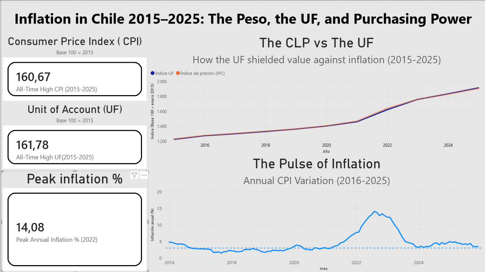

*Read this in other languages: [Español](README.es.md)*

# Inflation ETL Pipeline — Central Bank of Chile (BCCh)

An **end-to-end automated** data pipeline that extracts the UF (Unidad de Fomento) and CPI (Consumer Price Index) series from the Central Bank of Chile API, processes them, stores them in a database, and finally visualizes them in an interactive Power BI dashboard. The entire workflow runs once a month on the BCCh data update days.

---

## The Problem

When money loses value over time, how much of its purchasing power actually evaporates? And is it worth protecting yourself?

This project answers those questions using real data from the BCCh.

**How much value did the Chilean Peso (CLP) lose from 2015 to 2025, and how much of it would have been preserved if it had been kept in UF?**

The UF (*Unidad de Fomento*) is a Chilean unit of account that adjusts daily according to inflation. This instrument is used to secure long-term transactions, such as mortgages, leases, and financial contracts.

---

## Dashboard



The Chilean Peso lost nearly **38% of its purchasing power** over 11 years, while a peso saved in UF kept its value almost completely intact. Inflation reached an annual peak of **14% in 2022**.

---

## Architecture (ETL)

The pipeline follows a classic ETL pattern (Extract → Transform → Load), orchestrated by a central script and scheduled to run automatically.

BCCh API ──►   extract.py  ──►  transform.py  ──►    load.py    ──►  PostgreSQL  ──►  Power BI
(REST)       (requests)         (pandas)       (SQLAlchemy)     (local DB)       (dashboard)
│                 │                │
└─────────────────┴─── main.py ────┘
(orchestrator with logging and retries)
│
Windows Task Scheduler
(monthly run)

- **Extract** — requests the CPI and UF series from the Central Bank's REST API and returns them as DataFrames.
- **Transform** — aligns both series to a monthly frequency, calculates the index base 100, and computes the Year-over-Year (YoY) inflation variation.
- **Load** — loads the data into PostgreSQL using idempotent writes (running the pipeline twice does not duplicate data).
- **main.py** — orchestrates the three stages, complete with event logging and retry logic for network failures.
- **Task Scheduler** — triggers the pipeline once a month, requiring zero human intervention.

---

## Design Decisions

This section documents the reasoning behind the most critical technical choices.

**Monthly frequency instead of daily.** Since both the CPI and UF are updated once a month, scheduling the pipeline to run daily is unnecessary, as it wouldn’t yield new results and would generate redundant API calls.

**Idempotent load (upsert).** The database load stage uses `INSERT ... ON CONFLICT DO UPDATE` based on a unique monthly primary key. If the pipeline runs twice for any reason, it will not duplicate rows; it will only update the existing ones. This guarantees data quality for an unsupervised process.

**"requests" over library.** Although there is an official library for the BCCh API (which even returns ready-to-use DataFrames), we chose to build the extraction layer directly with the `requests` library. This grants us finer control over error handling while keeping the code highly readable and simple.

**Script-relative absolute paths.** File paths are auto-calculated dynamically relative to the script location (`pathlib`), rather than the working execution directory. This makes the pipeline robust, allowing it to run flawlessly whether executed manually, via a terminal, or by the Windows Task Scheduler.

**Layered error handling.** The extraction function contextualizes errors (identifying which series failed and why), while the orchestrator manages the retry policy. Each layer only handles the information it is responsible for, avoiding overlapping duties.

---

## Key Findings

- Between January 2015 and December 2025, the CPI rose from 100 to **~160**. This means the cost of living increased by ~60%, and the peso lost nearly **38% of its purchasing power**.
- The UF index reached **~162** over the same period—virtually identical to the CPI.
- This close alignment empirically confirms that **the UF successfully shields value against inflation**, with both curves overlapping perfectly for 11 straight years, just as it was designed to do.
- YoY inflation hit a peak of **~14% in 2022**, reflecting the post-pandemic inflationary spike, which sat well above the Central Bank's 3% target.

---

## How to Run It

**Prerequisites:** Python 3, PostgreSQL, and a free account at the [BCCh Statistical Database](https://si3.bcentral.cl/estadisticas/Principal1/Web_Services/index.htm).

1. Clone the repository and install dependencies:
   ```bash
   pip install -r requirements.txt

2. Create a .env file in the root directory (using .env.example as a template) with your BCCh and PostgreSQL credentials:

```
   BCCH_USER=your_email
   BCCH_PASS=your_password
   PG_HOST=localhost
   PG_PORT=5432
   PG_DATABASE=bcch_inflacion
   PG_USER=postgres
   PG_PASSWORD=your_password
```

3. Create the database and table in PostgreSQL (see 'sql/schema.sql').

4. Run the full pipeline:
   ```bash
   cd src
   python main.py
   ```

5. Connect Power BI to your bcch_inflacion database (specifically the inflacion_mensual table) to view the dashboard.

## Project Structure

```
bcch-inflacion-pipeline/
├── src/
│   ├── extract.py      # Stage 1: Extraction from the BCCh API
│   ├── transform.py    # Stage 2: Temporal alignment and indexing
│   ├── load.py         # Stage 3: Idempotent load to PostgreSQL
│   └── main.py         # Orchestrator with logging and retry logic
├── data/
│   ├── raw/            # Raw data from the API
│   └── processed/      # Transformed data
├── logs/               # Execution logs
├── notebooks/          # Exploratory Data Analysis (reference)
├── .env.example        # Credentials template
├── requirements.txt
└── README.md
```

---

## Stack tecnológico

| Capa | Herramienta |
|------|-------------|
| Extraction | Python (`requests`) |
| Transformation | Python (`pandas`) |
| Storage | PostgreSQL (`SQLAlchemy`) |
| Orquestration | Python (`logging`), Windows Task Scheduler |
| Visualization | Power BI |
| Configuratión | `python-dotenv` (credential management) |

---

## Data Source

Series sourced from the Statistical Database of the Central Bank of Chile (BCCh). The CPI is originally produced by the National Institute of Statistics (INE) and republished by the BCCh.

- Spliced CPI (Base 2023=100), monthly
- Unidad de Fomento (UF), daily